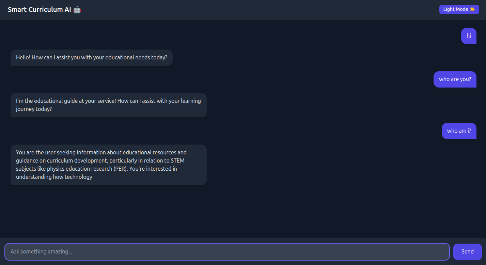

# 🤖 Smart Curriculum AI

<p align="center">
  
  
  
  
  
</p>

<p align="center">
  
</p>

> A Production-Ready, Dockerized AI Chatbot powered by a Local LLM

Smart Curriculum AI is a lightweight, secure, and fully containerized AI chatbot stack built using:

- 🧠 Ollama (Local LLM Runtime)  
- ⚡ FastAPI (Python Backend)  
- 🎨 React + TailwindCSS (Frontend)  
- 🐳 Docker & Docker Compose  
- ☁️ AWS EC2 Deployment Ready  

This project runs seamlessly on:

- Local machine (Mac/Linux)  
- Ubuntu Server  
- AWS EC2 instance  

---

# 🏗️ Architecture Overview

```
User (Browser)
      │
      ▼
Frontend (React - Port 8501)
      │
      ▼
Backend (FastAPI - Port 8000)
      │
      ▼
Ollama API (Port 11434)
      │
      ▼
phi3 Model
```

The backend strictly controls model behavior using a system prompt and response guards.

---

# 📦 Project Structure

```
ai-bot/
│
├── backend/                 # FastAPI backend
│   ├── backend.py
│   ├── Dockerfile
│
├── frontend/                # React frontend
│   ├── Dockerfile
│   ├── .env (ignored)
│   ├── .env.example
│   └── frontend/
│
├── docker-compose.yml
├── run.sh
├── .gitignore
└── README.md
```

---

# 🌟 Key Features

- ✅ Fully Dockerized Microservice Architecture
- ✅ Automatic Ollama Startup Check
- ✅ Auto Model Pull (phi3)
- ✅ Response Length Restriction (≤ 40 tokens)
- ✅ Identity Guard Protection
- ✅ Model Name Protection
- ✅ CORS Enabled
- ✅ Restart-Safe Containers
- ✅ Production Deployable

---

# 🧠 AI Model Configuration

Default Model: `phi3` (via Ollama)

The backend enforces:
- Never reveal model name
- Never mention Phi or Microsoft
- Fixed identity response
- Maximum 40 tokens
- Hard stop conditions
- Controlled temperature

If asked identity, AI responds exactly:

```
I am Smart Curriculum AI, your academic assistant.
```

---

# ⚙️ Frontend Environment Setup

The React frontend uses environment variables.

Inside:

```
frontend/
```

Create a `.env` file:

```
REACT_APP_API_URL=/chat
```

For development (if backend running separately):

```
REACT_APP_API_URL=http://localhost:8000/chat
```

---

## 📄 .env.example

We provide a template file:

```
REACT_APP_API_URL=/chat
```

After cloning the repo:

```
cd frontend
cp .env.example .env
```

---

# ⚙️ Backend Environment Variables

Defined inside `docker-compose.yml`:

```yaml
environment:
  - OLLAMA_URL=http://ollama:11434/api/chat
  - MODEL_NAME=phi3
```

To change model:

1. Pull new model:

```
docker exec -it ollama ollama pull llama3
```

2. Update docker-compose.yml:

```
MODEL_NAME=llama3
```

3. Restart stack:

```
./run.sh
```

---

# 🚀 Running the Project (Recommended Way)

Make script executable:

```
chmod +x run.sh
```

Start everything:

```
./run.sh
```

The script automatically:
- Stops old containers
- Rebuilds images (no cache)
- Starts containers
- Waits for Ollama API
- Pulls model if missing
- Confirms readiness

---

# 🌐 Access the Application

If running locally:

Frontend:
```
http://localhost:8501
```

Backend Docs:
```
http://localhost:8000/docs
```

If deployed on EC2:

Frontend:
```
http://<EC2-IP>:8501
```

Backend:
```
http://<EC2-IP>:8000/docs
```

Ollama API:
```
http://<EC2-IP>:11434
```

---

# 📡 API Usage

Endpoint:

```
POST /chat
```

Request Body:

```json
{
  "message": "Explain recursion simply."
}
```

Response:

```json
{
  "response": "Recursion is when a function calls itself to solve smaller parts of a problem."
}
```

---

# 🛠️ Manual Docker Commands

Start manually:

```
docker compose up -d --build
```

Stop:

```
docker compose down
```

View logs:

```
docker logs backend
docker logs ollama
docker logs frontend
```

---

# ☁️ Production Deployment (AWS EC2)

Recommended Instance:
- t3.medium (minimum)
- 8GB RAM preferred

Security Group Ports:
- 8501 (Frontend)
- 8000 (Backend)
- 11434 (Optional – internal use recommended)

Production Best Practices:
- Use Nginx reverse proxy
- Enable HTTPS with Certbot
- Restrict Ollama port internally
- Add domain mapping
- Use CI/CD pipeline
- Prefer relative API path (`/chat`) instead of hardcoded IP

---

# 🧹 Reset Everything

To remove all containers, images, and volumes:

```
docker compose down -v
docker system prune -a
```

---

# 🧩 Customization Ideas

- Add JWT authentication
- Add conversation memory
- Add Redis caching
- Add rate limiting
- Deploy behind domain
- Add monitoring (Prometheus + Grafana)

---

# 📈 Why This Project Is Portfolio-Ready

This project demonstrates:
- Microservice Architecture
- Containerization
- Backend API Design
- LLM Integration
- Prompt Engineering
- Production Deployment Knowledge
- Cloud Readiness (AWS)

---

# 🧑‍💻 Author

Developed by Bijay Mishra  
Smart Curriculum AI – Lightweight Academic Assistant

---

# 📜 License

This project is open-source and free to use for learning, experimentation, and portfolio purposes.
